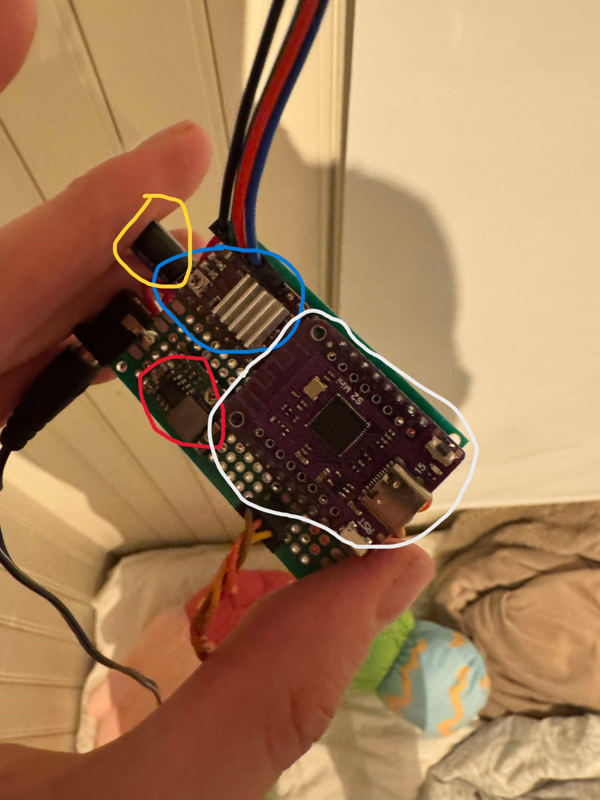
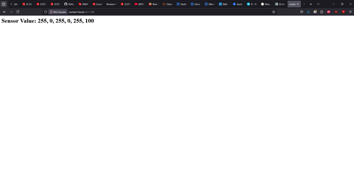
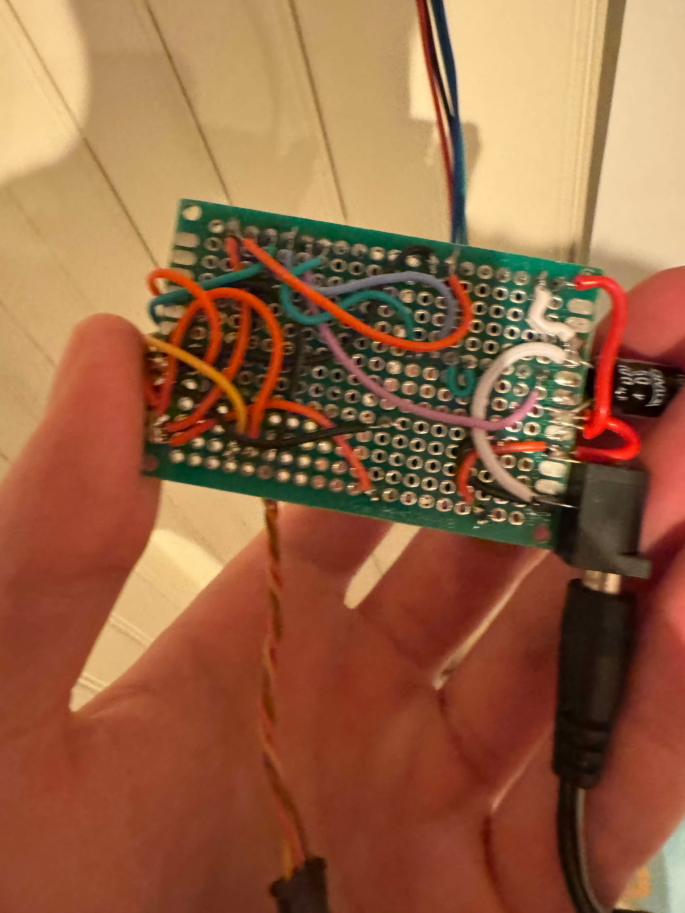
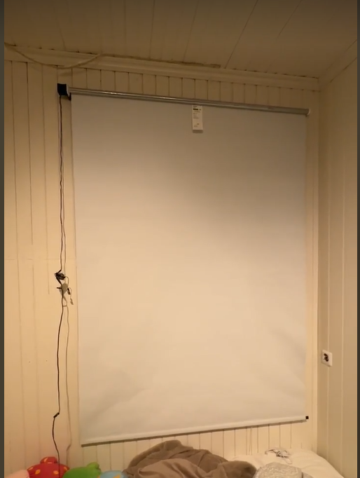
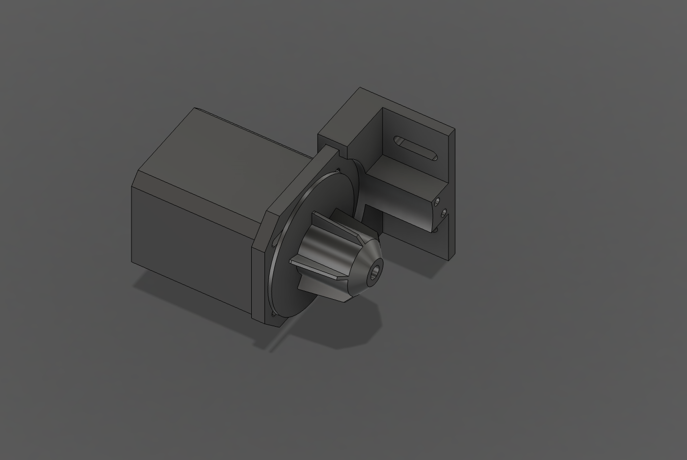

# Oblig TMA4106

For oblig I TMA4106 har jeg valgt å «Bygge noe revolusjonerende». Spesifikt å automatisere rullgardinene min på rommet. 

Målet med prosjektet er å til syvende og sist styre de via zigbee. Men per nå er det over wifi, som funker det også.

Hjernen bak gardinen er en esp32 lolin S2 mini (Hvit sirkel). Kildekoden ligger [vedlagt](kode/servo_nettside.ino). Grunnen til at gardinen har verdier mellom 0 og 255, er for enkel integrering med esp-alexa, som gjør slik at jeg kan styre gardinen med alexa.

For å bevege på gardinen bruker jeg en standard steppermotor. For å få denne til å funke bruker jeg en motordriver (blå sirkel). 

I den røde sirkelen er en stepdown fra 5v til 3.3v, siden jeg tar inn kun 5v og esp-en bruker 3.3V.

Kondensatoren(gul sirkel) er der for å sikre gjevn spenning. Knappen er der kun for oppsett, slik at jeg får stoppet gardinen på vei opp.

Her er noen bilder av interface + gardinen:  
**Interface:**  

**Gardinen:**

Gardinen er en ganske standard IKEA gardin. For å få motoren til å funke har jeg 3d printet et [tannhjul](bilder/mountogsprocket.png) som går inni gardin-kjernen. I tillegg har jeg 3d printet wallmount. Disse filene ligger [vedlagt](fusion_filer).

**Wallmount og sprocket:**

I tillegg til dette har jeg «teknisk» verv i Teknologi komiteen i elektra. Her er jeg nestleder og er ansvarlig for back-end for nettsiden. Dette innebærer mye programmering, hovedsakelig i python og html, samt noe deligering av ansvar i back-end teamet. Jeg er også ansvarlig for sammarbeid og integrering med front-end.
